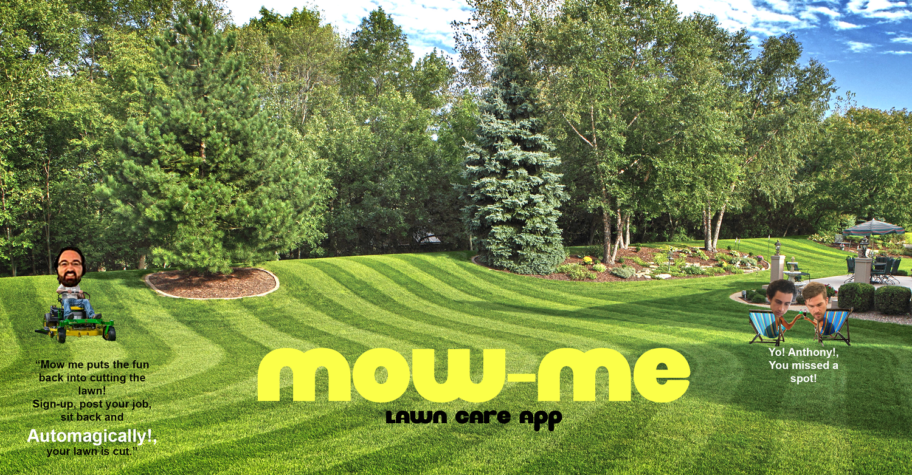

# :house_with_garden: Mow-Me

### Overview

A MERN (Mongo, Expres, React, Node) service for lawn care.  It is a marketplace for people with lawns and for people who want to cut lawns.  Owners submit their address, cut date and asking price.  Once the job is posted, a user can claim the job.

### Functionality
Mow-Me has following features:
  1. <strong>Login/Logout</strong> Users must create an ID and then sign in.  Passport handles this               functionality.  Once logged in, passport handles the important session data including logging out and           post/put requests.
  2. <strong>Create a Job </strong> Users' list a job using a React form.  The job is posted to the DB and then available for another user to claim.  
  3. <strong>Claim A Job</strong> Users' claim a job by hitting the 'claim button.  That buttons makes a PUT request to the DB which changes a boolean value that removes it from the board.

### Link to App
<!-- * <strong>[Burger! Burger! Burger!](https://ancient-reef-11912.herokuapp.com/)</strong> -->

### Screenshot

